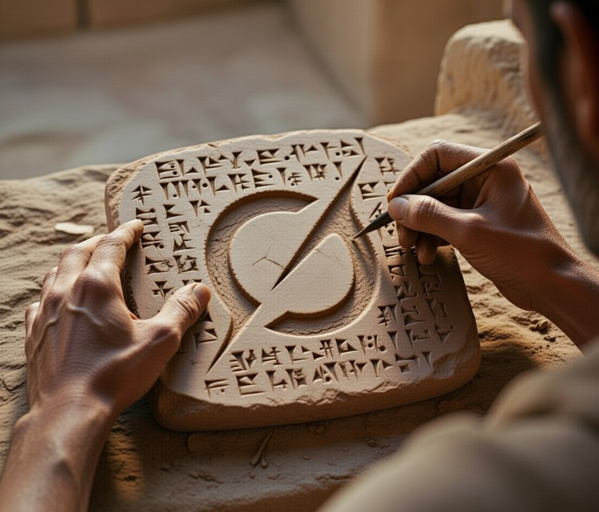

# AncientGrok



Complete toolkit for ancient world research combining conversational AI, database access, and state-of-the-art language translation.

```
 ▗▄▖ ▗▖  ▗▖ ▗▄▄▖▗▄▄▄▖▗▄▄▄▖▗▖  ▗▖▗▄▄▄▖▗▄▄▖▗▄▄▖  ▗▄▖ ▗▖ ▗▖
▐▌ ▐▌▐▛▚▖▐▌▐▌     █  ▐▌   ▐▛▚▖▐▌  █ ▐▌   ▐▌ ▐▌▐▌ ▐▌▐▌▗▞▘
▐▛▀▜▌▐▌ ▝▜▌▐▌     █  ▐▛▀▀▘▐▌ ▝▜▌  █ ▐▌▝▜▌▐▛▀▚▖▐▌ ▐▌▐▛▚▖ 
▐▌ ▐▌▐▌  ▐▌▝▚▄▄▖▗▄█▄▖▐▙▄▄▖▐▌  ▐▌  █ ▝▚▄▞▘▐▌ ▐▌▝▚▄▞▘▐▌ ▐▌

Ancient World Knowledge • AI Research • State-of-the-Art Translation
```

---

## Overview

AncientGrok is a comprehensive research platform for ancient civilizations, combining:

- **Interactive CLI Agent** - 18 agentic tools for database access, image generation, and research
- **Translation Benchmarking** - State-of-the-art LLM evaluation achieving 23.90 BLEU on Sumerian→English
- **Database Integration** - CDLI (500K+ cuneiform tablets), Open Context (147K+ archaeological records)
- **Complete Toolkit** - Everything needed for ancient world research in one place

**Key Achievement:** 23.90 BLEU on Sumerian→English translation (beats previous SOTA 22.04)

---

## Project Components

### 1. AncientGrok CLI - Interactive Research Agent

**Location:** `src/ancientgrok/`  
**Status:** ✅ Production ready  
**Capabilities:** 18 agentic tools powered by Grok AI

**Features:**
- Search 500,000+ cuneiform tablets (CDLI database)
- Access 147,000+ archaeological records (Open Context)
- Generate historical visualizations (Grok Imagine)
- Create research reports (LaTeX to PDF)
- Download academic papers
- Analyze tablet images with AI vision
- Look up 1,205 cuneiform signs (with filtering)
- Real-time cost tracking
- Auto-open for generated content

```bash
cd ancientgrok
pip install -e .
export XAI_API_KEY="your-key"
ancientgrok

# Try: "Search CDLI for Ur III tablets"
# Try: "Generate an image of the Ishtar Gate"
# Try: "Create a research report on Sumerian writing"
```

See [CLI Documentation](src/ancientgrok/README.md) for complete details.

---

### 2. Translation Benchmarking Framework

**Location:** `clay-voices/`  
**Status:** ✅ Production ready  
**Achievement:** 23.90 BLEU (New SOTA on Sumerian→English)

**Features:**
- Multi-provider LLM evaluation (Claude, GPT, Gemini, Grok)
- Grok batch API integration with pagination
- In-context learning experiments (0-2000 shots)
- Complete evaluation suite (BLEU, chrF++)
- Cost tracking and optimization

**Key Result:**
- **23.90 BLEU** using Grok 2000-shot (beats Claude's 22.04)
- Leverages Grok's 2M context for extreme in-context learning
- First demonstration of 2000-shot translation

```bash
cd clay-voices
pip install -r requirements.txt
export XAI_API_KEY="your-key"

python src/benchmark.py \
  --model grok-4-1-fast-non-reasoning \
  --dataset sumerian \
  --shots 2000 \
  --test-size 100 \
  --mode batch
```

See [GROK_SOTA.md](GROK_SOTA.md) and [clay-voices/README.md](clay-voices/README.md) for details.

---

### 3. CDLI API Client

**Location:** `cdli-cli/`  
**Status:** ✅ Production ready  
**Coverage:** 500,000+ cuneiform artifacts

Production-ready Python client for the Cuneiform Digital Library Initiative API.

```bash
cd cdli-cli
pip install -e .
cdli find "Ur III" --per-page 50
cdli image both P000001
```

---

### 4. Shared Resources

**Location:** `data/`, `docs/`, `scripts/`

- **data/:** Unicode cuneiform database (1,205 signs)
- **docs/:** Benchmarks, datasets catalog, resource guides
- **scripts/:** Dataset download automation

---

## Quick Start

### Install AncientGrok CLI

```bash
# Clone the repository
git clone https://github.com/samshapley/ancientgrok.git
cd ancientgrok

# Create virtual environment (recommended)
python3 -m venv .venv
source .venv/bin/activate  # On Windows: .venv\Scripts\activate

# Install ancientgrok CLI
pip install -e .

# Install cdli-cli dependency
cd cdli-cli
pip install -e .
cd ..

# Set API key
export XAI_API_KEY="your-xai-api-key"

# Launch
ancientgrok
```

See [SETUP.md](SETUP.md) for complete installation instructions.

---

## Project Structure

```
ancientgrok/
├── src/ancientgrok/          # CLI agent (18 tools)
│   ├── agent.py              # Core orchestration
│   ├── cdli_tools.py         # CDLI database (5 tools)
│   ├── opencontext_tools.py  # Open Context (3 tools)
│   ├── cuneiform_tools.py    # Sign reference (2 tools)
│   ├── vision_tools.py       # Image analysis (1 tool)
│   ├── bibliography_tools.py # Paper downloads (1 tool)
│   ├── image_tools.py        # Image generation (1 tool)
│   ├── report_tools.py       # Report generation (1 tool)
│   └── media_tools.py        # Image editing (1 tool)
├── clay-voices/              # Translation benchmarking
│   ├── src/                  # Multi-provider clients
│   ├── data/                 # Sumerian-English corpus
│   ├── results/              # Experimental results
│   └── paper/                # Research paper
├── cdli-cli/                 # CDLI API client library
├── data/                     # Shared cuneiform database
├── docs/                     # Documentation
├── scripts/                  # Dataset downloaders
├── GROK_SOTA.md             # 23.90 BLEU achievement
├── ARCHITECTURE.md          # System architecture
└── README.md                # This file
```

---

## Key Achievements

**Translation (clay-voices):**
- **23.90 BLEU** on Sumerian→English (beats 22.04 SOTA)
- Grok 2000-shot leveraging 2M context
- Multi-provider benchmarking framework

**CLI Tool (AncientGrok):**
- 18 integrated agentic tools
- Real database access (CDLI, Open Context)
- Image generation and research reports
- Complete ancient world research toolkit

---

## Documentation

- [SETUP.md](SETUP.md) - Complete installation guide
- [FEATURES.md](FEATURES.md) - CLI features and tools
- [TESTING.md](TESTING.md) - Test evidence
- [GROK_SOTA.md](GROK_SOTA.md) - Translation SOTA achievement
- [clay-voices/README.md](clay-voices/README.md) - Benchmarking details
- [docs/BENCHMARKS.md](docs/BENCHMARKS.md) - Complete benchmark results
- [docs/DATASETS.md](docs/DATASETS.md) - Dataset catalog
- [docs/RESOURCES.md](docs/RESOURCES.md) - External resources

---

## System Requirements

- Python 3.9+
- xAI API key (for CLI and Grok benchmarks)
- Optional: Claude/GPT/Gemini keys (for multi-provider benchmarks)
- Optional: LaTeX (for PDF reports)

---

## License

MIT License - see [LICENSE](LICENSE)

---

## Acknowledgments

- **xAI Grok** - AI with 2M context and agentic capabilities
- **CDLI** - Cuneiform Digital Library Initiative
- **Open Context** - Archaeological data platform

---

**AncientGrok** - Advancing ancient world understanding through frontier AI